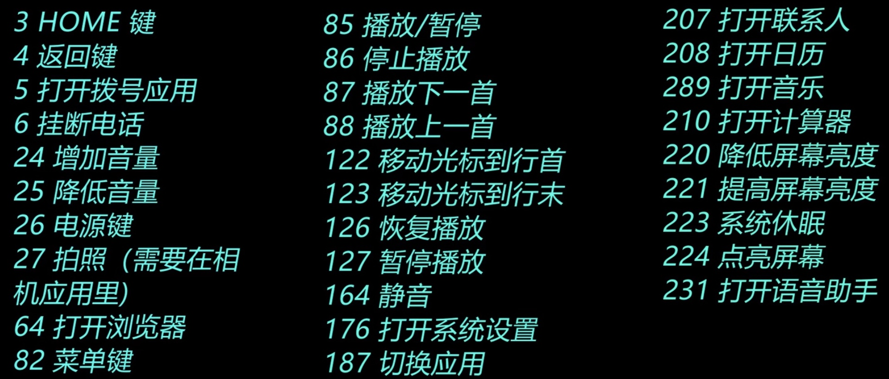

# ADB
    全称 Android Debug Bridge-安卓调试桥
可以通过电脑输入命令的方式控制手机，执行更高权限的操作
## 普通ADB命令
1. adb devices(显示已连接设备)
   超过一台设备时abs-s+序列号的方式让指定设备运行命令
2. adb install(安装命令)
   1. 若安装的apk在abd目录下，可直接输入文件名安装
   例如：adb install test.apk
   2. 若不在同一目录下，可直接将apk拖到命令行里，自动填充路径
   例如：adb install C:\Users\Jamcz\Desktop\test.apk
   3. 若路径中含有空格，请给路径添加英文引号
   例如：adb install "C:\Users\Jamcz\Desktop\test.apk"
3. adb install+参数+apk路径
   参数：
    -t 允许安装debug版测试包
    -l 锁定应用程序
    -s 将应用程序安装到sd卡上
    -g 安装后自动授予所有权限
    -r 替换已存在的应用程序，强制安装
    -d 允许降级安装
4. adb uninstall+参数+软件包名(卸载命令)
    参数：-k保留数据卸载
5. adb push/pull(推送/接受文件)
   1. 电脑传输文件到手机：adb push +电脑路径+手机路径
   2. 从手机传到电脑：adb pull +手机路径+电脑路径（若文件名含有中文文件名，需在手机端中补全中文，否则将推送后失去后缀名）
6. adb reboot(重启命令)
    1. reboot:重启手机
    2. reboot recovery:重启到恢复模式
    3. reboot bootloader:重启到fastboot模式
    4. reboot fastboot:重启到fastbootd模式(VAB区分机型)
    5. reboot edl:重启到9008串口模式
    6. reboot download:重启到挖煤模式
    7. reboot -p:关机
   reboot fastboot与reboot bootloader的区别
   前者：对于VAB分区机型，可重启到fastbootd模式。
   此模式下可刷Super小分区：如system、vendor等。
   后者：与VAB分区无关，全部可重启到fastboot模式。通常刷boot、super等。
## Shell型命令
#### 非交互式：adb shell+命令直接执行
#### 交互式：adb shell加命令内容，再执行命令
 1. shell型命令：活动管理器am（Activity Manager）
  活动可理解为App的个界面的名称，类似Windows中的窗口Android软件可通过Activity直接跳转到指定的界面，而且无需经过启动界面。
  分为：
   am start+包名+/+活动名（让app启动并跳转到指定页面）
   am force-stop+包名（强制结束正在运行中的软件）
2. shell型命令：包管理器pm（Package Manager）
   包管理器命令可实现对系统软件/第三方软件高权限控制
   如禁用（也叫冻结、停用）、卸载、清除数据、获取权限、获取路径等。
   分为：
    pm disable-user+包名（强制禁用系统软件和第三方软件）
    pm enable+包名（启用软件）
    pm unistall--user 0+包名（卸载系统软件）
    cmd package install-existing+包名（恢复系统软件）
    提取APK：
    1. 获取apk路径：pm path+包名
    2. 推送（使用普通型命令，输入exit退出交互shell）:adb pull+apk路径+电脑路径
    3. 若卸载前忘记提取apk可以使用pm list package|grep+包名中的一部分来获取所有包名再通过findstr或grep命令来模糊搜索
3.  shell型命令：窗口管理器wm（Window Manager）
   1. 修改分辨率：wm size+xPx(宽度像素)+x+yPx（高度像素）
   2. 修改DPI：wm density+数值
4.  shell型命令：input
    可模拟各种触摸，机身按键等，非常适合做自动化
    1. 模拟点击屏幕：input tap x y
    2. 模拟滑动屏幕：input swipe x1 y1 x2 y2 d(x1 y1为起点坐标，x2 y2为终点坐标，d为滑动时长ms)
    3. 模拟按键：input keyevent+键值
    
    4. 发送文字：input text+内容