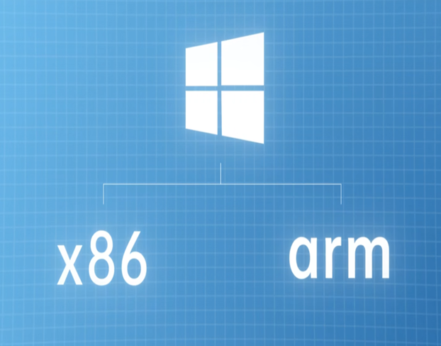
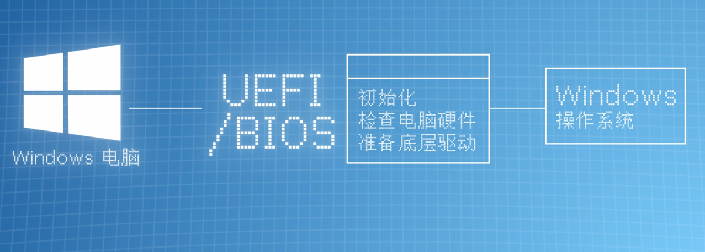
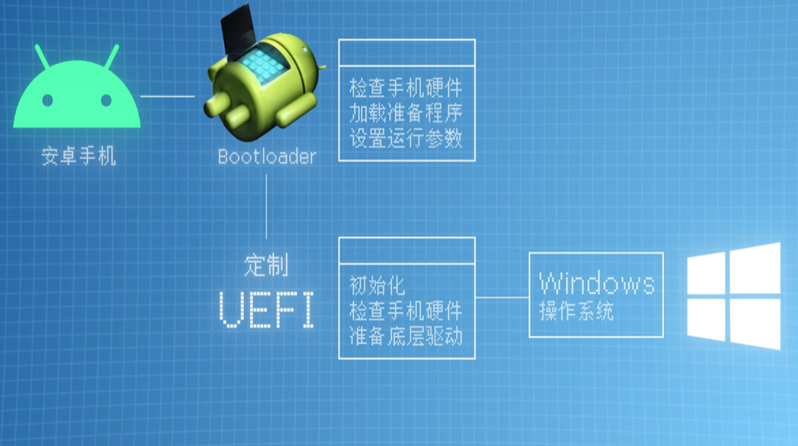

# Android手机上跑windows原理

学过小学2年级的都知道Windows本来就有原生的ARM版本，像Surface Pro X不就是高通处理器，甚至高通芯片的很多驱动都能从Windows On ARM笔记本上扒过来。所以对于手机来说，又有系统又有驱动，为什么不能装Windows呢？
思来想去，我们或许缺少的只是一个启动固件UEFI。我们手机在进入安卓系统之前，也有这样的一个启动的步骤就是Bootloader。它会检查你手机的硬件，加载一些必要的准备程序，帮你设置好运行内核的必要参数，全部准备好后才会帮你启动内（kernel）,再往后就会进入安卓系统的第一个进程了。

其实，Windows也是一样的。在系统启动之前需要进行平台初始化，准备好CPU、芯片组、各种底层驱动，这个过程就是UEFI做的事。
所以说白了Bootloader也好，UEFI也好，它们都是软硬件之间的一层对接层。
所以怎么才能在安卓手机上启动Windows呢？
## 答案：
就是要编译一个为手机硬件设计的UEFI，然后在Bootloader阶段加载它。

但是此时有一个bug,正常情况下你的安卓设备是不能随便加载UEFI的
## 解决方案：
把UEFI伪装成Linux内
核，这样的话就可以顺利加载了。
（适合845、855平台）
## 警告：
###### 由于现在各家厂商对bl锁的限制导致现在市面上只有1加可以进行传统的刷机方案，而且对于新手小白来说把手机刷成板砖那是常有的事情，所以传统的刷机方案在这里我们就不多做介绍，下一篇文章我们将介绍不需要解开bl锁就可以刷机的方法，当然如果你头够铁想了解详细教程请打开下方链接：
https://renegade-project.tech/en/install

