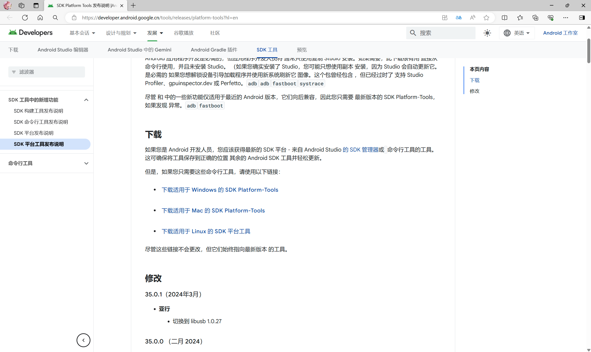
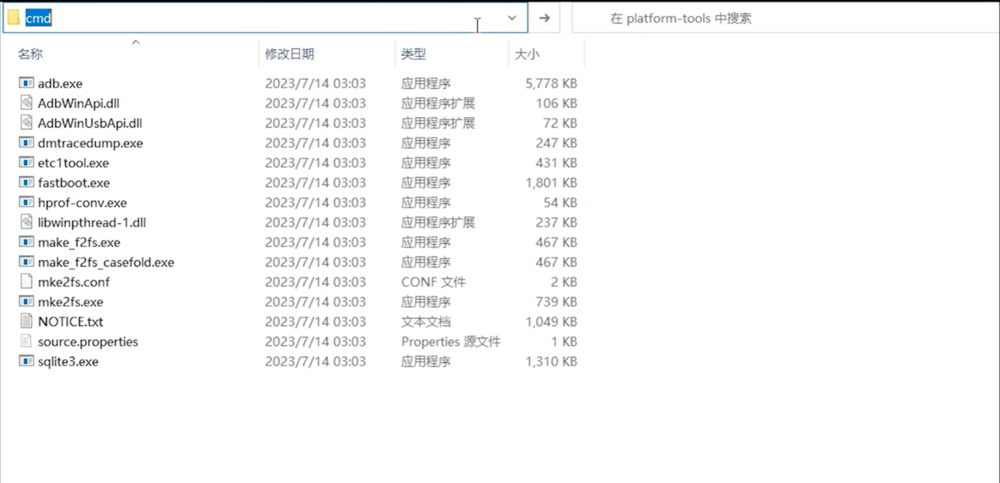
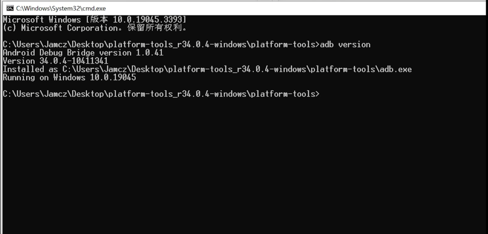
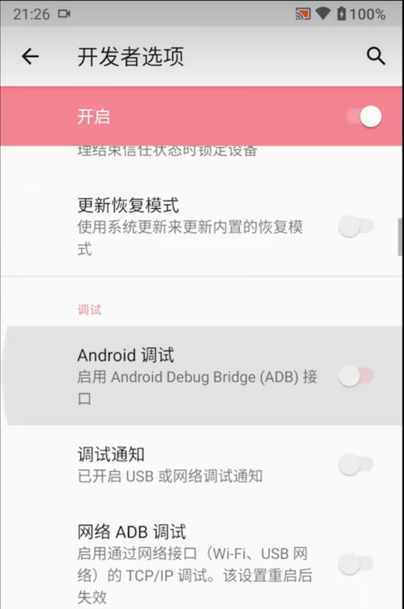
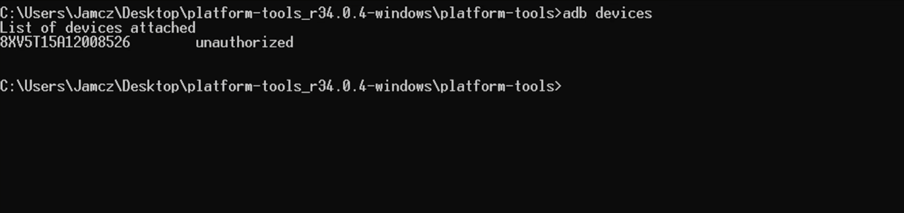
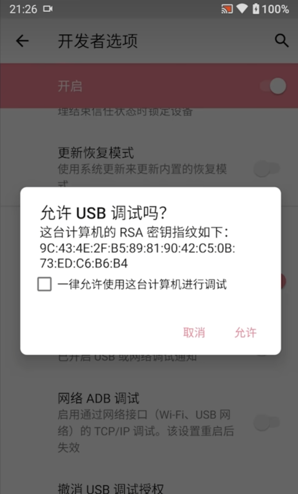
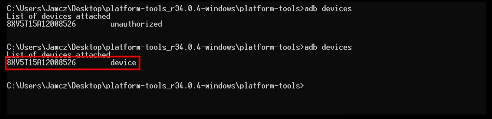

# ADB的前瞻
###### 在前面中我们提到现在由于手机厂商的限制我们无法解开lb锁自然更无法获得root权限，可我们消费者只能就此坐以待毙了吗，别忘了手机可是我们自己花钱买过来的为什么我们无法拥有其百分百的权力！为此在这一节，我将教给大家一个叫ADB的东西来获取手机更大的权限。
### 介绍：
ADB全称Android Debug Bridge安卓调试桥，用户可以通过在电脑端输入命令的方式来实现对手机高权限的控制，本质上是留给开发者用于调试设备的端口。
其中就包括强制停用软件（这样不会卸载软件可以随时手动恢复回去）
###### 介绍就到此为止了，接下来我将带领大家进行使用ADB命令前的准备工作，而下一节就是一些常用的ADB命令了。
1. 配置电脑端环境
   1. 去安卓官网下载Android SDK
    
      https://developer.android.google.cn/tools/releases/platform-tools?hl=en
   2. 下载并解压后会发现有很多文件但是ADB仅需要用到这三个文件就可以了
   
   3. 点击地址栏，输入cmd打开命令行、
   
   4. 再输入adb version，可以看到输出了ADB版本这就代表电脑端环境已经配置完成
   
2. 配置手机端环境
   1. 打开开发者模式（由于不同品牌手机打开方式有所差异，请读者自行查阅，笔者在这里就省略了）
   2. 进入开发者选项后，再打开USB调试选项即可
   
   3. 将手机用数据线连接电脑，在电脑段的命令行输入adb devices
   
   4. 此时手机上会跳出一个授权通知，在这里勾选永久允许
   
   5. 此时电脑端显示序列号，这就代表连接成功了
   
完成这些操作后我们的前期准备环节就完成了，接下来就是愉快的搞机时刻！