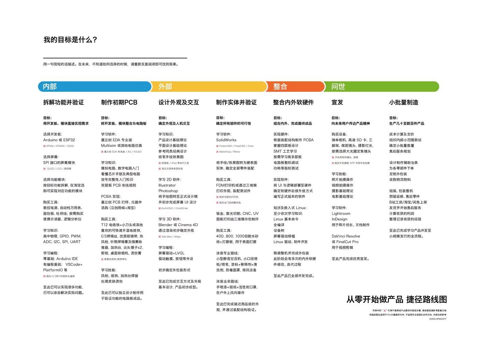
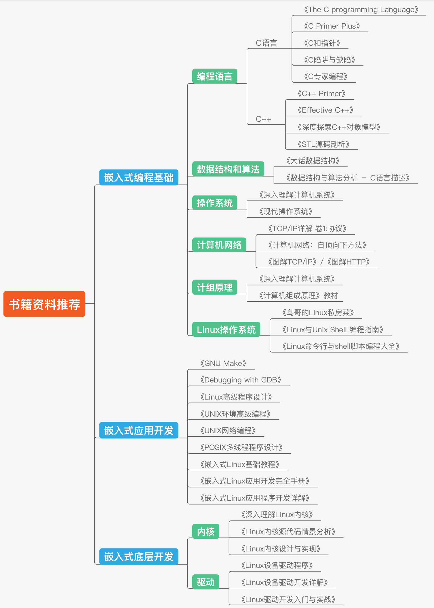

# 嵌入式开发的学习路线

总体学习思路
总体来说，还是可以把嵌入式学习分为三个大的阶段：

首先基础学习阶段，这就包括通用编程基础（C语言、数据结构/算法、操作系统、计网、计组、Linux系统基础）和基本的硬件基础，扎实地掌握这两大基础，是后续持续发展和不断进步的动力源泉。

其次就是嵌入式应用编程阶段，或者说系统平台编程阶段。因为一般会以特定的嵌入式平台和特定的嵌入式操作系统为依托，熟悉这个系统平台上的编程方法和流程。以常见的ARM+Linux平台为例，需要掌握从内存管理到多任务编程、文件I/O、网络编程，甚至图形化界面编程等几个大的方面。

最后就是深入嵌入式底层开发阶段，最常见的就是内核开发和驱动开发，这些统属于内核态开发范畴，所以需要对操作系统内部机制有所涉猎和理解，在此基础上需要掌握从系统移植到内核开发、驱动开发的各个细节，这是成神之路。
### 模块1-C语言
重点把握指针、位操作、结构体的字节对齐、位段、宏的高级应用
在嵌入式里面内存是稀缺资源。
https://www.koudaizy.com/tutorials/microcontroller-embedded-c-programming/
（C+stm32）
### 模块2-C++
1. C++基础特性（类、对象、派生、继承、运算符重载、友元、虚函数、多态、模板、STL的使用）
2. C++的面向对象的构建能力，比C++语言特性更加重要（比如说给你三代产品，一代二代三代嵌入式产品让你使用C++的面对对象特性，给它快速的构建一套类和接口使用继承聚合啊等等手段，也就构建一个合适的一个数据模型）
https://www.koudaizy.com/tutorials/embedded-programming-with-c/
### 模块3-数据结构和算法

### 模块4-数据库
1. 重点掌握mysql(国内嵌入式应用最多的数据库)
   安装、部署、设计、访问、增删改查
2. 了解sqlite轻量级数据库
   安装、部署、设计、访问、增删改查
### 模块5-Qt开发
1. 对于嵌入式应用开发，需要重点掌握。（掌握这个嵌入式的一个模块类、基础控件、布局、对话框、主窗体、绘图、图形视图框架、Qt文件编程、网络编程、数据库、事件处理、多线程、QML还有最后的移植等等）
2. 对于嵌入式底层开发，可以跳过。
### 模块6-嵌入式Qt开发
1. 嵌入式开发环境的配置。
2. Qt应用程序移植到嵌入式设备（比如车载、医疗、系统、设备上面）。
### 模块7-嵌入式Linux开发
嵌入式Linux内核空间小，熟悉嵌入式Linux系统开发主要就是他的一个系统本身的使用，交叉编译工具链的安装使用，还有Linux内核、嵌入式Linux内核移植到嵌入式芯片，制作嵌入式Linux的一个根文件系统.最重点的Linux系统的一个系统编程，最后Linux系统应用程序的一个调试。
### 模块8-嵌入式协议的开发（重头）
MODBUS的基本使用

### 模块9-嵌入式上位机的开发
上位机的界面那个UI的设计和实现，上位机写的控制命令或者查询命令。按照这个硬件设备，它自己指定的格式封装成一个特殊的数组或者一个协议把它发出去一个有协议的封装，还有下位机他收到这个响应之后他会发一个响应包，反馈给我们上位机，然后上位机收到之后要进行解析。

### 模块10-嵌入式硬件
最下面是硬件，硬件上面是嵌入式底层，开发嵌入式底层软件（实现程序控制硬件）。

所以嵌入式软件开发主要的两个分支嵌入式应用开发来实现应用功能，嵌入式底层开发主要实现嵌入式芯片的接口驱动。
# 选择嵌入式应用开发的话
熟练掌握前面的基础模块和第8个模块，熟练掌握嵌入式硬件通信协议，再了解一下硬件的一些接口就够了。
# 选择嵌入式底层开发的话
学C语言、汇编、单片机、ARM处理ARM系列的，还有芯片架构、处理器指令、接口驱动、电路原理图的分析、电路启动的bootloader的一个开发、Linux内核的、一个驱动开发还有另外的示波器、频谱仪、万用表、焊烙铁等等。
https://www.koudaizy.com/tutorials/arduino-sbs-17gs/
(arduino uno)
### 从零开始做产品 捷径路线图

### 学习路线图

### 书籍推荐图

# 所有的东西脱离项目就是零