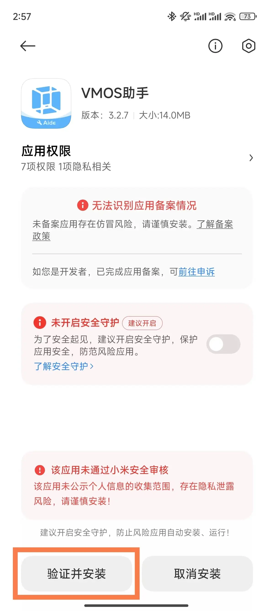

# 无需解bl锁来刷windows系统教程
###### 本教程用到两款软件（VMOS助手、以及GitHub上的开源项目小小电脑）
### If 你的手机安卓版本大于等于12需提前用到VMOS助手工具
1. 打开https://www.vmos.cn/zhushou.htm 后

2. 点击下载并无视安装

3. 打开软件后点击去激活，并去开启

4. 打开允许通知，并返回再次点击去激活，点击继续

5. 选择无限制，返回界面，再次点击去激活进入激活准备界面
 
6. 打开开发者模式，图中为成功打开开发者模式后的样子（由于不同品牌手机打开方式有所差异，请读者自行查阅，笔者在这里就省略了）

7. 接下来点击去开启
8. 软件自动进入开发者页面，往下滑在调试栏中找到无线调试

9. 点击进入打开无线调试开关，并确认

10. 点击下方使用配对码配对设备，此时手机会生成一个6位数的配对码记住它。

11. 下滑打开通知中心会收到VMOS助手的通知，若通知被折叠则长按它。让它显示出完整的通知，并输入配对码。

12. 填完后点击右侧的纸飞机按钮，此时返回VMOS助手页面会发现它已经正常运行了。
13. 接下来进行和小于等于安卓12版本相同的操作即可。
### Else if你的手机是老机型安卓版本小于12
###### 则正式使用本次教程中最重要的工具小小电脑
1. 打开GitHub项目地址：https://github.com/Cateners/tiny_computer

2. 一直往下拉可以找到Release栏
 
3. 点击这里的 v1.0.15（随着作者更新版本号可能会有所不同） 

4. 打开后往下滑

5. 点击tiny-computer-xfce.apk，即可下载 

6. 下载后完成安装即可
7. 打开软件并允许一下权限
8. 静待进度条跑完

9. 恭喜您已经完成安装
###### 虽然说这是装了个windows系统但是不全真，看谁能发现它的伪装喽